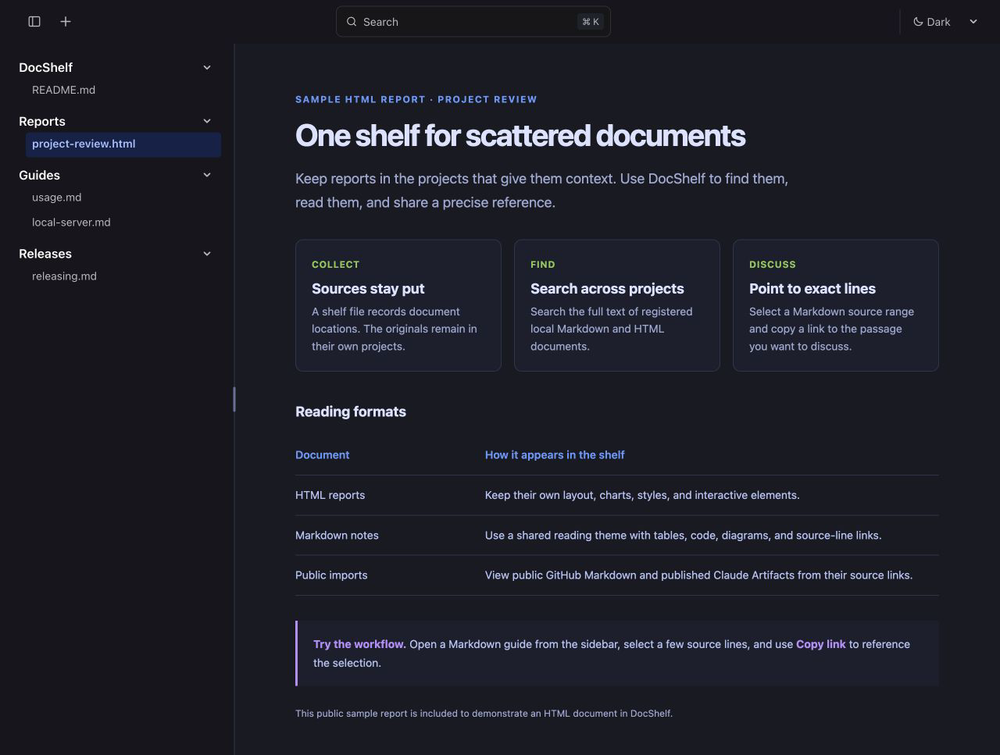
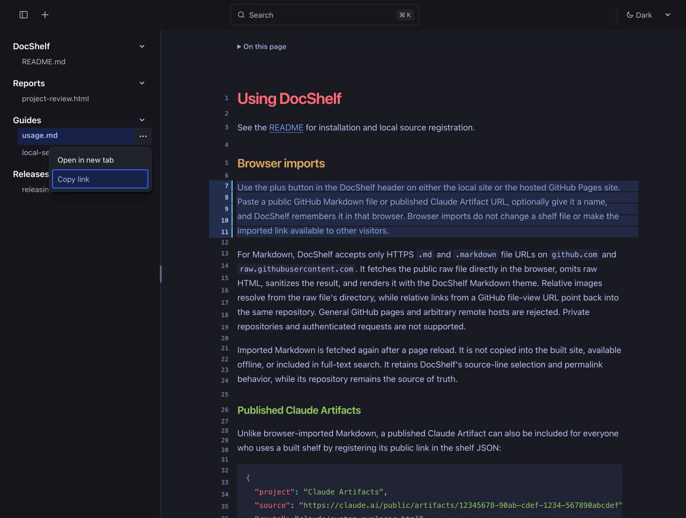

3# DocShelf

A home for Markdown and HTML notes scattered across projects.

**[Try the live demo](https://oliver-im.github.io/docshelf/?artifact=docshelf%2Freadme.html)**



## Why this is needed

While it is very common to have agent generated markdown or html reports, how to store and view them is surprisingly scattered. A common method is to store it in user space path such as `~/.codex`, but this makes it hard to discover. Another common way is to put them in one pre-defined path, but agents are currently bad at indexing and parsing symlink files. The most common way is to just store them in the repo that contains the context for the report, but this makes it scattered across projects.

DocShelf solves this with one shelf: a JSON file that maps the locations of your documents. It adds [full-text search through Starlight and Pagefind](https://starlight.astro.build/guides/site-search/) for registered local documents and a Markdown reading theme adapted from [Tokyo Night for Obsidian](https://github.com/tcmmichaelb139/obsidian-tokyonight). It also comes with a lightweight skill, so you can tell your agent to "add it to DocShelf". Public GitHub Markdown files and published Claude Artifacts can be added as remote links, too.

## Line Range Permalinks

Permalinks support source-line ranges, similar to GitHub code review, so you can point an agent to an exact passage. Click a gutter line number, Shift-click another to extend the selection, then copy the URL from your browser's address bar. The URL updates automatically to include the document and range, such as `?artifact=guides%2Fusage.html#L7-L11`.



---

## Run locally

You need **Git, Node.js 24 or newer**, and a filesystem that supports symbolic links. Automatic setup is macOS-only; other platforms can use `npm run watch`. CI runs on Ubuntu and local verification has covered macOS; Windows has not yet been verified.

Put DocShelf beside the projects you want to catalog:

```text
workspace/
├── docshelf/
└── example-project/
```

For a new installation on macOS:

```sh
mkdir -p ~/workspace
cd ~/workspace
git clone https://github.com/oliver-im/docshelf.git
cd docshelf
npm ci
npm run setup
```

Open **[https://shelf.localhost/](https://shelf.localhost/)** when setup reports that the shelf is ready. Setup reuses a compatible [Portless](https://github.com/vercel-labs/portless) proxy or offers to install one, asks before administrator access or certificate trust changes, and installs DocShelf to start automatically when you log in.

Your first shelf contains DocShelf's README, so navigation and search work immediately. Existing shelf entries are preserved. The watcher rebuilds when a registered document or the shelf changes.

For a foreground server without automatic startup, use `npm run watch`. Keep using the same address: browser imports and preferences belong to that site origin. See [setup details and troubleshooting](https://github.com/oliver-im/docshelf/blob/main/docs/local-server.md).

Already installed? Follow the [upgrade instructions](https://github.com/oliver-im/docshelf/blob/main/docs/local-server.md#updating-an-existing-installation).

## Register local documents

Edit the `artifacts` array in your ignored `shelf.local.json`. Keep the README entry if you want it, and add entries for files that already exist:

```json
{
  "project": "Example Project",
  "source": "../example-project/docs/overview.md",
  "route": "example-project/overview.html",
  "title": "Project overview",
  "description": "An overview of the example project."
}
```

`source` is relative to the DocShelf checkout and must end in `.html` or `.md`. The file must resolve inside the workspace root: DocShelf's parent directory, unless `DOCSHELF_WORKSPACE` names another directory, absolute or relative to the checkout. Set that variable for every DocShelf command when the checkout does not sit beside the projects it catalogs; `npm run setup` records it in the login service. `route` is a unique, lowercase path ending in `.html`, even for Markdown. Keep routes stable so bookmarks keep working.

DocShelf creates generated HTML snapshots and never edits the original files. Links between registered sources are rewritten only in the generated output. It does not crawl or serve unregistered neighboring files, including images. The tracked `shelf.json` stays an empty template; your registrations belong in `shelf.local.json`.

To register a published Claude Artifact in the shelf, see [supported links and embed setup](https://github.com/oliver-im/docshelf/blob/main/docs/usage.md#published-claude-artifacts).

## Read and navigate

Choose a document in the sidebar, or search for a word inside a registered local document. Drag the sidebar divider to resize it; `Command/Ctrl+B` hides or shows the sidebar.

Use a document's **⋯** menu to open it in a new tab or copy its viewer link. Remote documents offer **View source**. Local files offer **Reveal in Finder** when the macOS loopback watcher is running. Native browser right-click remains available.

For Markdown, click a gutter line number and Shift-click another to select a range. **Copy link** preserves that selection, such as `#L14-L20`. The **On this page** outline navigates longer documents by heading.

Read the [viewer and Markdown guide](https://github.com/oliver-im/docshelf/blob/main/docs/usage.md) for keyboard controls, browser import behavior, and rendering details.

## Add documents with an agent

Install the included `docshelf` skill globally:

```sh
npx skills add oliver-im/docshelf --skill docshelf -g
```

After creating a report or note, ask your agent to **“add this to DocShelf.”** The skill registers the finished source, preserves existing shelf entries, and verifies the result. It does not author or restyle documents. The optional [HTML theme](https://github.com/oliver-im/docshelf/blob/main/.agents/skills/docshelf/references/theme.md) is a separate authoring resource.

## Content boundaries

| Source | Stored content | Full-text search | Requirements |
| --- | --- | --- | --- |
| Registered local HTML or Markdown | Generated local snapshot; original stays in its project | Yes | File inside the workspace |
| Browser-imported GitHub Markdown | Source link in browser storage; fetched again on reload | No | Public HTTPS `.md` or `.markdown` file |
| Published Claude Artifact | Claude-hosted cross-origin embed | No | Exact published Artifact URL and DocShelf origin allowed by its owner |

Browser-import bookmarks depend on that browser's saved source link. Sharing the bookmark alone does not transfer the import to another visitor. Private GitHub repositories, arbitrary remote pages, and offline remote imports are not supported.

Register only local HTML you trust: it can run scripts with DocShelf's origin. GitHub Markdown is sanitized, but its images and links can contact remote sites. Keep the server's default loopback binding unless you intend to expose your registered documents to the network. See the [security policy](https://github.com/oliver-im/docshelf/blob/main/SECURITY.md).

## Running, developing, and releasing

- [Local server, upgrades, troubleshooting, and macOS login service](https://github.com/oliver-im/docshelf/blob/main/docs/local-server.md)
- [Versioning, release notes, and release procedure](https://github.com/oliver-im/docshelf/blob/main/docs/releasing.md)

Use `npm run dev` while changing DocShelf's UI. Before handing off code changes, run `npm test`, `npm run check`, and `npm run build`. Use `npm run watch` for production search and automatic source updates.

## License

MIT. The Markdown and optional HTML themes adapt Tokyo Night for Obsidian; the optional HTML theme also includes matcha.css. See the [third-party notices](https://github.com/oliver-im/docshelf/blob/main/THIRD_PARTY_NOTICES.md).
