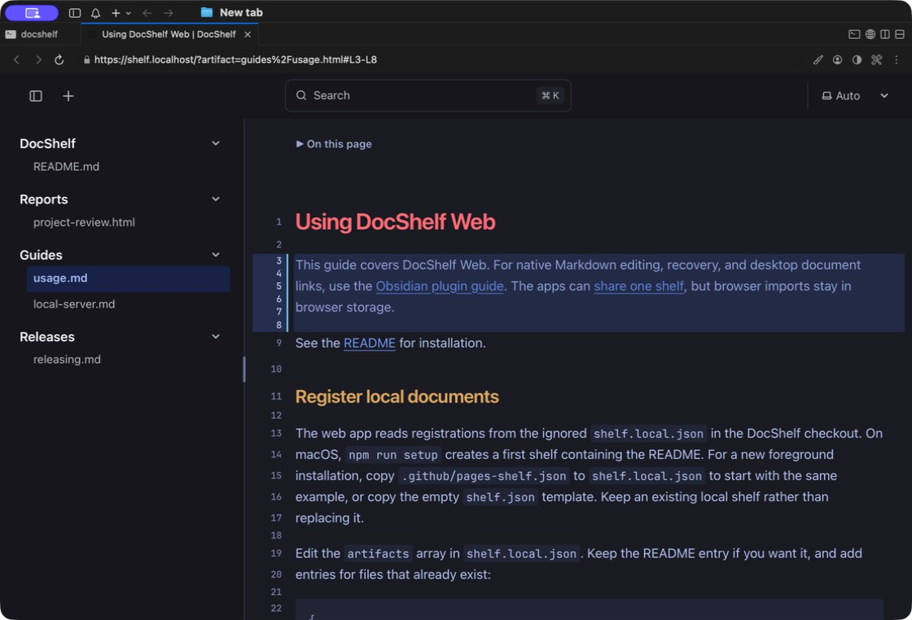
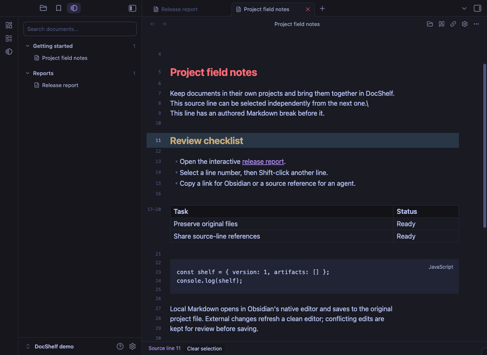
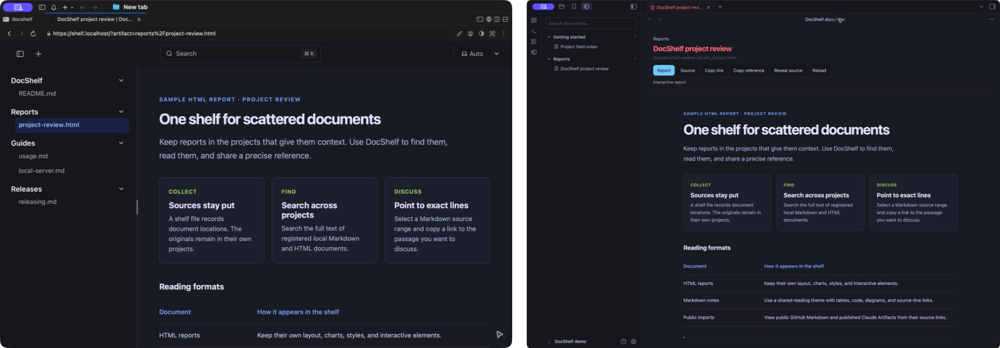

# DocShelf

Browse Markdown and HTML documents across your projects.

[](https://github.com/oliver-im/docshelf/releases) [][obsidian-download]

## Key features

- **A shelf across projects.** Add files or folders where they live, and view their Markdown and HTML in Obsidian or in the browser. Folders are discovered recursively and update automatically.
- **Links to exact passages.** Select Markdown source lines and copy a link to that document and line range. Links start with `obsidian://docshelf` for Obsidian or `https://shelf.localhost/` for the web app after local setup.

**[DocShelf Web Demo](https://oliver-im.github.io/docshelf/?artifact=docshelf%2Freadme.html)**

## Why DocShelf?

Project notes, design documents, and agent-generated reports belong beside the work they describe. But as they spread across repositories, finding and reading them becomes a chore. DocShelf brings the documents you choose into one shelf, while also providing a way to select the lines, similar to GitHub permalink, to easily discuss the exact content with the agent.

## Choose your app

Use either app independently, or [point both at the same shelf](https://github.com/oliver-im/docshelf/blob/main/docs/unification.md#use-one-shelf).

### DocShelf Web

Read Markdown, search across your local documents, and link to exact source lines. Runs as a local web app, without opening Obsidian. The web app never edits your originals.



### DocShelf for Obsidian

Bring project documents into Obsidian without copying them into your vault. Edit local Markdown in the native editor, with changes saved to the original file, with conflict checks and recovery.



## Browse HTML in either app

Open HTML reports alongside your Markdown notes. Reports keep their own layout, styling, and interactive elements; both apps display them without editing the source file.



[Web screenshot](https://github.com/oliver-im/docshelf/blob/main/public/docshelf-web-html.jpg) · [Obsidian screenshot](https://github.com/oliver-im/docshelf/blob/main/public/docshelf-obsidian-html.jpg)

## Get started

Packaged Obsidian builds install without Git, Node.js, or the web app; see [Install the Obsidian plugin](#install-the-obsidian-plugin). To build from source or run the web app, install **Git and Node.js 24 or newer** and clone DocShelf beside the projects you want to catalog:

```sh
mkdir -p ~/workspace
cd ~/workspace
git clone https://github.com/oliver-im/docshelf.git
cd docshelf
npm ci
```

Then follow the setup for your app.

### Set up the web app

On macOS:

```sh
npm run setup
```

Open **[https://shelf.localhost/](https://shelf.localhost/)** when setup finishes. Your first shelf includes this README. Choose a document in the sidebar or use search to find a passage. DocShelf starts automatically when you log in; setup asks before administrator access or certificate trust changes.

For a foreground server on other platforms or without automatic startup, use `npm run watch`. See the [web app setup guide](https://github.com/oliver-im/docshelf/blob/main/docs/local-server.md) for the address, first-shelf setup, and troubleshooting. The web app requires a filesystem with symbolic-link support; Windows is not yet verified.

### Install the Obsidian plugin

Requires **desktop Obsidian 1.13.7 or later**. The **desktop beta** supports manual installation and is not yet listed in the community directory. Runtime verification covers macOS with Obsidian 1.13.7; Windows, Linux, and Obsidian 1.14.2 are not yet verified.

**[Download DocShelf for Obsidian ZIP][obsidian-download]** · [Release notes][obsidian-release]

Extract the ZIP and copy its `docshelf` folder into `<vault>/.obsidian/plugins/`. Enable **DocShelf** in Community plugins.

To produce that ZIP from this checkout:

```sh
npm run package:obsidian
```

The ZIP is written to `packages/obsidian/dist/release/docshelf-X.Y.Z.zip`, using the plugin version. You can also install the folder at `packages/obsidian/dist/docshelf/` directly. When updating, disable DocShelf and copy the new files into the existing plugin folder, preserving `data.json` and `recovery/`.

Open **DocShelf: Open shelf** from the command palette and use **Add…** to choose a project, then files, folders, or a mixture. Right-clicking a project or document uses that project directly. On macOS, click **Add** in the picker to register the selection immediately. To use an existing shelf, choose it in **DocShelf: Configure shelf**. See [adding files and folders](docs/folders.md) for recursive discovery and the shared shelf format.

DocShelf reads explicitly registered files outside the vault so documents can remain in their project folders. Local Markdown edits save to the originals; settings and private recovery copies stay in the plugin directory. Interactive HTML runs through an isolated viewer and a token-protected loopback server. Reports and Markdown images may load HTTPS resources; GitHub Markdown uses `raw.githubusercontent.com`, and published Claude Artifacts use `claude.ai` and resources loaded by that page. There is no telemetry or account requirement. See [file access and network disclosure](packages/obsidian/README.md#file-access-and-network-disclosure).

## Add documents with your agent

Install the very lightweight `docshelf` skill to add the documents to DocShelf easily:

```sh
npx skills add oliver-im/docshelf --skill docshelf -g
```

After creating a report or note, ask your agent:

> Add this report to DocShelf.

The skill registers the original file, preserves existing shelf entries, checks the result, and returns links for your configured apps. It can also return a source-line reference for a specific passage.

To register documents manually, follow the [web app registration guide](https://github.com/oliver-im/docshelf/blob/main/docs/usage.md#register-local-documents) or [Obsidian registration guide](https://github.com/oliver-im/docshelf/blob/main/packages/obsidian/README.md#register-documents).

## Guides

- [DocShelf Web: navigation, line links, and remote imports](https://github.com/oliver-im/docshelf/blob/main/docs/usage.md)
- [Using both apps with one shelf](https://github.com/oliver-im/docshelf/blob/main/docs/unification.md)
- [Development and verification](https://github.com/oliver-im/docshelf/blob/main/docs/local-server.md#development-and-verification)
- [Releasing DocShelf](https://github.com/oliver-im/docshelf/blob/main/docs/releasing.md)
- [Security and file access](https://github.com/oliver-im/docshelf/blob/main/SECURITY.md)

## License

MIT. Themes adapt Tokyo Night for Obsidian; the optional HTML theme also includes matcha.css. See the [third-party notices](https://github.com/oliver-im/docshelf/blob/main/THIRD_PARTY_NOTICES.md).

[obsidian-download]: https://github.com/oliver-im/docshelf/releases/download/0.2.0/docshelf-0.2.0.zip
[obsidian-release]: https://github.com/oliver-im/docshelf/releases/tag/0.2.0
